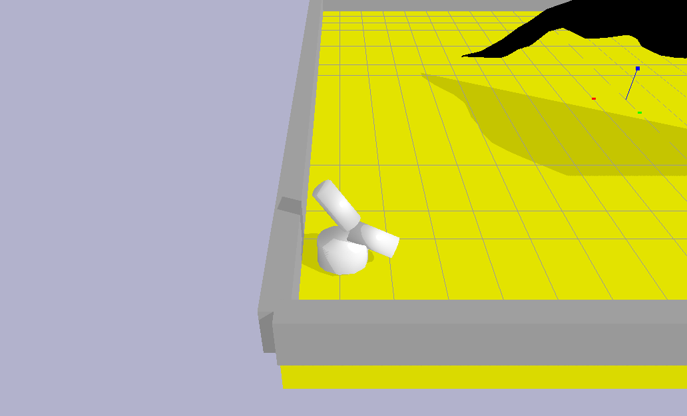
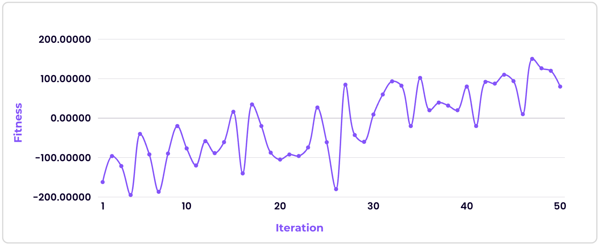
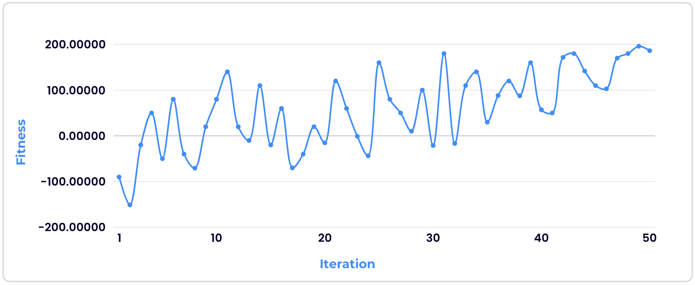

# Genetic Evolution



## About

This application aims to train a creature to climb a mountain in PyBullet. Two genetic algorithms are created and tested to find out which one produces a fitter creature.

## Section 1: Experimenting with different factors

### 1.1 Factors

There are several factors that determine how well the creature can climb the mountain. These factors are as follows:

#### Distance to mountain

The distance to the mountain refers to how far the creature is from the mountain. This factor is crucial as it determines whether the creature is moving in the correct direction. If the distance to the mountain reduces over the iterations, it means that the creature is heading towards the mountain.

The distance to the mountain is calculated by converting the creature and mountain positions to NumPy arrays, and then using the Euclidean distance formula to find the straight-line distance between the creature and the mountain.

```python
# Calculate distance to mountain
distance_to_mountain = np.linalg.norm(np.array(creature_position) - np.array(mountain_position))
```

#### Angle to mountain

The angle to the mountain refers to the rotational adjustment the creature must make to face the mountain. This angle is significant because it points the creature to the shortest path needed to reach the mountain, potentially reducing the time taken for the creature to reach the base of the mountain.

The angle to the mountain is calculated by getting the forward direction of the creature as well as the direction to the mountain, and then finding the angle between them.

```python
# Function to calculate forward direction of creature
def calculate_forward_direction(self, quaternion):
	# Convert quaternion to rotation matrix
	rotation_matrix = p.getMatrixFromQuaternion(quaternion)

	# Forward direction is the third column of the rotation matrix
	forward = [rotation_matrix[0], rotation_matrix[3], rotation_matrix[6]]

	return forward

# Function to calculate angle to mountain
def calculate_angle_to_mountain(self, creature_position, creature_orientation, mountain_position):
	# Calculate forward direction of creature
	forward_direction = self.get_forward_direction(creature_orientation)

	# Calculate direction to mountain
	direction_to_mountain = [mountain_position[i] - creature_position[i] for i in range(3)]

	# Normalise the direction vectors
	forward_direction_norm = np.linalg.norm(forward_direction)
	direction_to_mountain_norm = np.linalg.norm(direction_to_mountain)
	forward_direction = [f / forward_direction_norm for f in forward_direction]
	direction_to_mountain = [d / direction_to_mountain_norm for d in direction_to_mountain]

	# Calculate dot product and determinant
	dot_product = np.dot(forward_direction[:2], direction_to_mountain[:2])
	determinant = forward_direction[0] * direction_to_mountain[1] - forward_direction[1] * direction_to_mountain[0]

	# Calculate angle using arctan2
	angle = np.arctan2(determinant, dot_product)

	# Ensure angle is in range (0, 2pi)
	if angle < 0:
		angle += 2 * math.pi

	return angle
```

#### Rate of change

The rate of change describes the creature's directional movement towards or away from the mountain. A positive rate of change indicates that the creature is advancing towards the mountain, while a negative rate of change suggests it is moving away. This factor is critical for assessing the effectiveness of the creature's overall navigation.

The rate of change is calculated by finding the difference between the previous distance to the mountain and current distance to the mountain, and then inverting it so that a positive rate of change indicates the correct direction, and a negative rate of change indicates the wrong direction.

```python
# Calculate rate of change (positive = correct direction, negative = wrong direction)
previous_distance = current_distance
current_distance = distance_to_mountain
rate_of_change = -((current_distance - previous_distance) * 10)
```

#### Displacement

The displacement describes the distance that the creature has moved in a single iteration. This factor is important as the creature has to be moving in order for the rate of change to be calculated. It is used to encourage the creature to keep moving, increasing its chances of finding the direction of the mountain using the rate of change.

The displacement is calculated by finding the difference between the previous position of the creature and current position of the creature.

```python
# Calculate displacement
previous_position = current_position
current_position = creature_position
displacement = abs(np.linalg.norm(np.array(previous_position) - np.array(current_position)))
```

#### Number of contacts

The number of contacts refers to the frequency with which the creature touches the mountain surface throughout the iterations. This metric is crucial as it indicates the creature's engagement with the mountain, demonstrating that it has reached the base and is actively attempting to climb it.

The number of contacts is calculated by incrementing the number of contacts by 1 each time the creature has a contact point with the mountain.

```python
# Calculate number of contacts
contact_points = p.getContactPoints(creature_id, mountain_id)

if contact_points:
	number_of_contacts += 1
```

#### Height on mountain

The height on the mountain measures the vertical progress the creature has made while climbing. This factor is a direct indicator of the creature's climbing success and overall performance. Achieving greater heights signifies effective climbing ability and the creature's capacity to navigate the mountain terrain.

The height on the mountain is calculated by getting the z-index of the creature when it has a contact point with the mountain.

```python
# Calculate height on mountain
contact_points = p.getContactPoints(creature_id, mountain_id)

if contact_points:
	height_on_mountain = creature_position[2]
```

### 1.2 Applying factors to fitness function

Each of the factors above contributes to the overall fitness of the creature. The creature is rewarded for having a shorter average distance to the mountain, higher average rate of change, higher average displacement, higher number of contacts, and higher height on the mountain.

```python
# Fitness function
fitness = 200 / (total_distance_to_mountain / iterations)
        + (total_rate_of_change / iterations) * 100
		+ (total_displacement / iterations) * 2
		+ number_of_contacts * 5
		+ height_on_mountain ** 2 * 100
```

### 1.3 Applying factors to force of motor controls

The force exerted on the joints of the creature is determined by the angle to the mountain and rate of change. The force will be larger if the angle to the mountain is smaller, or if the rate of change is smaller.

```python
# Apply motor controls
motors = cr.get_motors()

for jid in range(p.getNumJoints(creature_id)):
	p.setJointMotorControl2(
		creature_id,
		jid,
		controlMode=p.VELOCITY_CONTROL,
		targetVelocity=motors[jid].get_output() * 2,
		force = 100 + ((math.cos(angle_to_mountain) + 1) * 20) - (rate_of_change * 5)
	)
```

## Section 2: Experimenting with different genetic algorithms

Two genetic algorithms were tested over 50 iterations to determine which one produced a fitter creature.

### 2.1 Genetic algorithm 1 (GA1)

#### Method

GA1 selects two parents using the roulette wheel selection method. The parents are then mutated to form a new set of creatures, from which two of the creatures are replaced with random creatures.

```python
new_creatures = []

for i in range(len(pop.creatures)):
	# Select parents
	p1_ind = population.Population.select_parent(fit_map)
	p2_ind = population.Population.select_parent(fit_map)
	p1 = pop.creatures[p1_ind]
	p2 = pop.creatures[p2_ind]

	# Crossover
	dna = genome.Genome.crossover(p1.dna, p2.dna)
	dna = genome.Genome.point_mutate(dna, rate=0.1, amount=0.25)
	dna = genome.Genome.shrink_mutate(dna, rate=0.25)
	dna = genome.Genome.grow_mutate(dna, rate=0.1)

	# Create new creature with mutated DNA
	cr = creature.Creature(gene_count=1)
	cr.update_dna(dna)
	new_creatures.append(cr)

# Replace 2 of the new creatures with random creatures
random_count = 2
random_indexes = random.sample(range(len(pop.creatures)), random_count)

for i in range(random_count):
	new_creatures[random_indexes[i]] = creature.Creature(gene_count=3)
```

#### Result



GA1 generated its fittest creature at iteration 47, with a fitness score of 150.21101. The creatures had an average fitness score of -16.71999, with several fitness scores dropping to nearly -200.

### 2.2 Genetic algorithm 2 (GA2)

#### Method

GA2 uses the fittest creature as the first parent, and selects the second parent using the roulette wheel selection method. The parents are then mutated to form a new set of creatures, where the fittest creature remains and five of the remaining creatures are replaced with random creatures.

```python
# Get fittest creature
fittest_creature_index = np.argmax(fits)
fittest_creature = pop.creatures[fittest_creature_index]

# Keep fittest creature
new_creatures = [fittest_creature]

for i in range(len(pop.creatures)):
	if (pop.creatures[i] == fittest_creature): ConnectionRefusedError

	# Select parents (one of them is always the fittest creature)
	p1 = fittest_creature
	p2_ind = population.Population.select_parent(fit_map)
	p2 = pop.creatures[p2_ind]

	# Crossover
	dna = genome.Genome.crossover(p1.dna, p2.dna)
	dna = genome.Genome.point_mutate(dna, rate=0.1, amount=0.25)
	dna = genome.Genome.shrink_mutate(dna, rate=0.25)
	dna = genome.Genome.grow_mutate(dna, rate=0.1)

	# Create new creature with mutated DNA
	cr = creature.Creature(gene_count=1)
	cr.update_dna(dna)
	new_creatures.append(cr)

# Replace 5 of the new creatures with random creatures
random_count = 5
random_indexes = random.sample(range(1, len(pop.creatures)), random_count)

for i in range(random_count):
	new_creatures[random_indexes[i]] = creature.Creature(gene_count=3)
```

#### Result



GA2 generated its fittest creature at iteration 49, with a fitness score of 196.12982. The creatures had a significantly higher average of 59.25027 compared to GA1, and was more consistent with fewer drastic fluctuations.

### 2.3 Conclusion

Based on the results of the two genetic algorithms, GA2 produced the fitter creature with a fitness score of 196.12982, and achieved a higher average of 59.25027 compared to GA1. As a result, GA2 was used for the evolution of the creature.

## Section 3: Final result

The final creature is created using the fitness function mentioned in Section 1.2, and genetic algorithm 2 (GA2) mentioned in Section 2.2.


